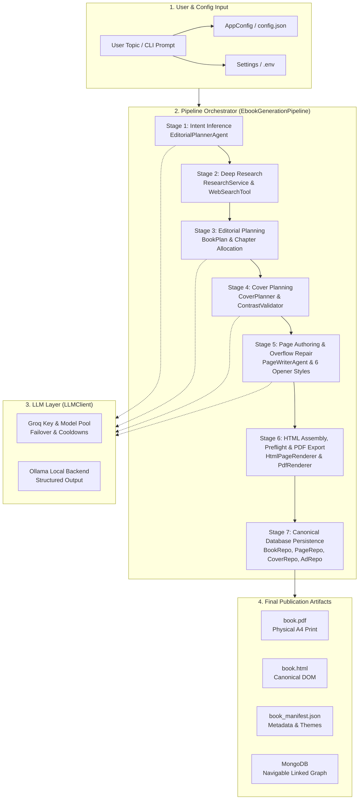

# VasukiSquare Architecture

VasukiSquare is an AI-powered research, editorial, HTML layout, and physical A4 PDF generation engine written in typed Python.

---

## 1. System Architecture Overview



---

## 2. Boundaries Between Logic Layers

VasukiSquare strictly decouples deterministic Python logic, LLM reasoning, research crawling, and physical layout rendering:

```
┌─────────────────────────────────────────────────────────────┐
│ 1. Deterministic Python Rules                               │
│    - Title length truncation (≤ 50 chars)                   │
│    - A4 physical geometry & zero-overflow repair            │
│    - Theme alternation (odd=dark, even=light)               │
│    - Doubly-linked page graph IDs                           │
│    - Source deduplication & domain ranking                  │
│    - Preflight audit validation                             │
├─────────────────────────────────────────────────────────────┤
│ 2. LLM Reasoning (LangChain + Pydantic Structured Output)    │
│    - Book intent & target audience inference                │
│    - Search query expansion & perspective generation        │
│    - Chapter structure & section outlining                  │
│    - Markdown-free structured component block authoring     │
│    - Cover style selection & color theme matching           │
├─────────────────────────────────────────────────────────────┤
│ 3. External Research Tools (HTTP / Search Backends)          │
│    - SearXNG, DuckDuckGo, Tavily, Serper, Brave APIs        │
│    - Wikipedia API & direct HTML web fetching               │
│    - Domain blacklisting & authoritative source ranking     │
├─────────────────────────────────────────────────────────────┤
│ 4. Rendering & Physical Export                              │
│    - Jinja2 HTML page generation                            │
│    - CSS layout engine with design tokens                   │
│    - Playwright Chromium headless A4 PDF compilation        │
└─────────────────────────────────────────────────────────────┘
```

---

## 3. Package & Module Organization

```
src/vasukisquare/
├── cli.py               # Unified CLI parser and execution runner
├── config/              # Pydantic settings (.env) and publication metadata (config.json)
│   ├── defaults.py      # Default publication JSON templates
│   ├── loader.py        # Safe configuration loader with human-readable syntax errors
│   ├── schema.py        # Validated AppConfig, Branding, and Copyright models
│   └── settings.py      # Infrastructure Settings and provider resolution
├── agents/              # Core AI reasoning agents
│   ├── base.py          # BaseAgent abstraction with telemetry
│   ├── editorial.py     # EditorialPlannerAgent (Intent and BookPlan)
│   ├── writer.py        # PageWriterAgent (Structured page authoring)
│   ├── cover.py         # CoverPlannerAgent (Cover design concepts)
│   ├── content_validator.py  # 15-point book content quality auditor
│   └── technical_content.py  # Topic classification & chapter research extraction
├── book/                # Domain models & component definitions
│   ├── components.py    # Structured content blocks (Hero, Code, Callout, Table, etc.)
│   ├── layout.py        # LayoutType and VisualAnchorType enumerations
│   ├── models.py        # Book, Page, Chapter, BookPlan, BookIntent models
│   └── richtext.py      # RichSpan rich-text models (bold, code, links)
├── cover/               # High-resolution cover artwork subsystem
│   ├── planner.py       # Geometric concept planner
│   ├── primitives.py    # SVG rendering primitives
│   ├── renderer.py      # 1600x2560 canvas and A4 cover renderer
│   ├── styles.py        # 6 cover style layout templates
│   └── validator.py     # WCAG contrast and layout validator
├── design/              # Design system & visual tokens
│   ├── tokens.py        # Mathematical color tokens & hex resolvers
│   ├── theme.py         # Light / Dark theme definitions
│   ├── themes.py        # BookThemeMap and palette generator
│   ├── icons.py         # Lucide SVG icon renderer & color resolver
│   ├── layout_engine.py # Spacing, padding, and layout rules
│   └── visual_components.py # HTML block wrappers
├── llm/                 # LLM client, model pools, key rotation, and telemetry
│   ├── client.py        # LLMClient (Groq model pool & Ollama backends)
│   ├── pool.py          # GroqKeyPool and GroqModelPool failover managers
│   └── metrics.py       # BookGenerationMetrics telemetry models
├── pipeline/            # End-to-end generation lifecycle
│   ├── orchestrator.py  # EbookGenerationPipeline orchestrator
│   └── state.py         # GenerationState pipeline state
├── renderer/            # HTML rendering, zero-overflow repair, and PDF compilation
│   ├── html.py          # HtmlPageRenderer (Jinja2 template assembly)
│   ├── pdf.py           # PdfRenderer (Playwright Chromium A4 PDF export)
│   ├── overflow.py      # OverflowDetector & PageRepairEngine
│   ├── preflight.py     # Preflight geometric validation
│   ├── components.py    # HTML component block renderer
│   └── validator.py     # Semantic content validator
├── research/            # Fact extraction, deduplication, and ranking
│   ├── service.py       # ResearchService coordinator
│   ├── planner.py       # Multi-perspective search query planner
│   ├── ranking.py       # Domain reliability & source ranking
│   ├── deduplication.py # URL normalization and fuzzy deduplication
│   └── models.py        # ResearchCorpus and SourceDocument models
├── tools/               # External search and scraping tools
│   ├── search.py        # WebSearchTool (SearXNG, DuckDuckGo, Tavily, etc.)
│   ├── wikipedia.py     # Wikipedia API tool
│   ├── fetcher.py       # Direct webpage HTML text extraction
│   └── base.py          # BaseTool abstraction
├── templates/           # Jinja2 templates and CSS
│   ├── styles.css       # Core physical A4 CSS rules
│   ├── book.html        # Book container template
│   ├── base.html        # Page frame template
│   └── cover.html       # Standalone cover template
└── database/            # PyMongo database persistence (optional)
    ├── connection.py    # DatabaseManager
    └── repository.py    # BookRepository, PageRepository, CoverRepository
```
